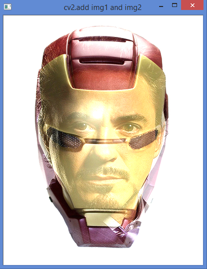
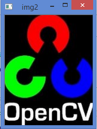
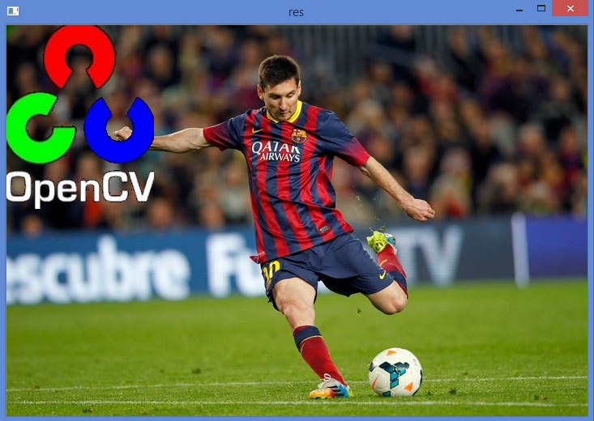

# Artithemetics Operations on Images

See [OpenCV-Python Tutorials - Artithemetics Operations on Images](https://opencv-python-tutroals.readthedocs.org/en/latest/py_tutorials/py_core/py_image_arithmetics/py_image_arithmetics.html#image-arithmetics) for the original Tutorials.

## Image Addition

The code `demo_image_arithmetics.py` illustrates `numpy` vs `cv2` additions. 

There is a difference between OpenCV addition and Numpy addition. OpenCV addition is a [saturated operation](http://en.wikipedia.org/wiki/Saturation_arithmetic) while Numpy addition is a [modulo operation](http://en.wikipedia.org/wiki/Modulo_operation).

Here is [a great post by Abid Rahman K](http://opencvpython.blogspot.co.uk/2012/06/difference-between-matrix-arithmetic-in.html) explaining the difference between these two additions.

For image processing problems, always stick to using the cv2 addition!

For example, the code `add_images.py` uses the `cv2.add()` method to add two images together (saturated operation).

Image 1:

 

Image 2:

 

Add image 1 and image 2 (using `cv2.add(), a saturated operation):

Notice that adding images essentially increase the color scale GBR value towards `(255, 255, 255)`. i.e. white. The more we add, the more likely we will get a "brighter / whiter" image. 

## Image Blending

The code `blend_images.py` illustrates blending image 1 and image 2 together (overlaying) incorporating assigning weights.

Here I will be using two images of the same size (400 width by 500 height pixels). I essentially downloaded the two images from a Google search, and resized them with the Windows Paint application.

Image 1:

 

Image 2:

 

Blend image 1 (`.7` weight) and image 2 (`.3` weight):

# Bitwise Operation

The code `bitwise_operate_images.py` illustrates Bitwise Operations on images - a powerful technique to enable us to achieve things like...

We have two images. 

Image 1 is photo of Messi.

Image 2 is the OpenCV logo (black background).

We wish to overlay the OpenCV logo (Opague) on top of the phot of Messi like this:

(Placeholder: more descriptions to be placed here.)

# Conclusion

Here we have run through some exercises on image addition and blending. We also performed Bitwise operation to essentially enable opague overlaying of an image over another.