# Artithemetics Operations on Images

See [OpenCV-Python Tutorials - Artithemetics Operations on Images](https://opencv-python-tutroals.readthedocs.org/en/latest/py_tutorials/py_core/py_image_arithmetics/py_image_arithmetics.html#image-arithmetics) for the original Tutorials.

## Image Addition

The code `demo_image_arithmetics.py` illustrates `numpy` vs `cv2` additions. 

There is a difference between OpenCV addition and Numpy addition. OpenCV addition is a [saturated operation](http://en.wikipedia.org/wiki/Saturation_arithmetic) while Numpy addition is a [modulo operation](http://en.wikipedia.org/wiki/Modulo_operation).

Here is [a great post by Abid Rahman K](http://opencvpython.blogspot.co.uk/2012/06/difference-between-matrix-arithmetic-in.html) explaining the difference between these two additions.

For image processing problems, always stick to using the cv2 addition!

For example, the code `add_images.py` uses the `cv2.add()` method to add two images together (saturated operation).

Image 1 - Iron Man:

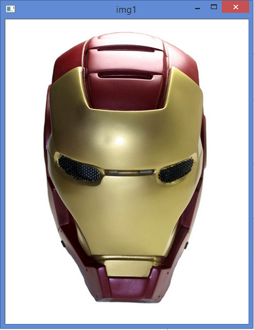 

Image 2 - Tony Stark:

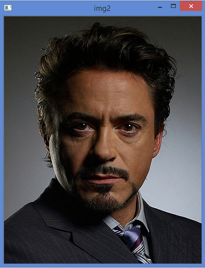 

Add image 1 and image 2 (using `cv2.add(), a saturated operation):


Notice that adding images essentially increase the color scale GBR value towards `(255, 255, 255)`. i.e. white. The more we add, the more likely we will get a "brighter / whiter" image. 

## Image Blending

The code `blend_images.py` illustrates blending image 1 and image 2 together (overlaying) incorporating assigning weights.

Here I will be using two images of the same size (400 width by 500 height pixels). I essentially downloaded the two images from a Google search, and resized them with the Windows Paint application.

Image 1 - Iron Man:

 

Image 2 - Tony Stark:

 

Blend image 1 (`.7` weight) and image 2 (`.3` weight):


# Image Thresholding

Objective of this section is to learn more about thresholding - in particular the 5 thresholding options in OpenCV.

The code `image_thresholding.py` code illustrates this.

See these articles for more info:

- [OpenCV-Python - Image Thresholding Blog by Abid Rahman K](http://opencvpython.blogspot.co.uk/2013/05/thresholding.html)
- [The 5 Image Thresholding Options](http://docs.opencv.org/doc/tutorials/imgproc/threshold/threshold.html)

Some screenshots:

Original Grayscale image:

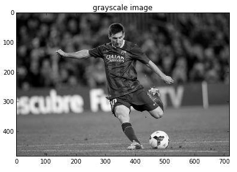

THRESH_BINARY:

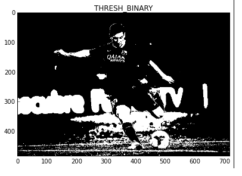

THRESH_BINARY_INV:

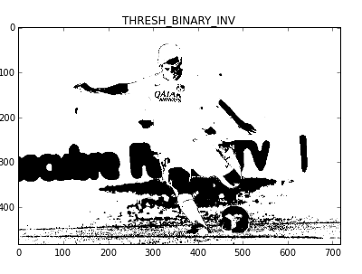

THRESH_TRUNC:

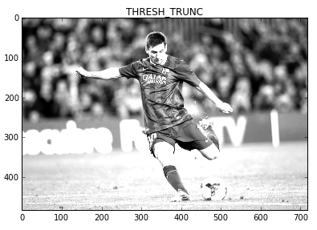

THRESH_TO_ZERO:

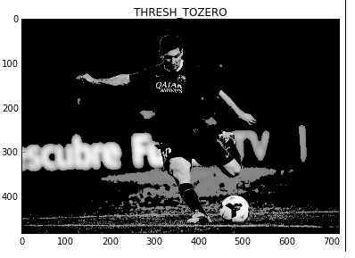

THRESH_TO_ZERO_INV:


# Bitwise Operation

The code `bitwise_operate_images.py` illustrates Bitwise Operations on images - a powerful technique to enable us to achieve things like...

We have two images. 

Image 1 is photo of Messi.


Image 2 is the OpenCV logo (black background).


We wish to overlay the OpenCV logo (Opague) on top of the phot of Messi like this:


Some key facts to know:

- In a 256 (8 bits) true color world, intensity ranges from 0 (000000) to 255 (11111111).
- So, see the decimal intensity 255 (white) as binary 1 (True), and decimal intensity 0 as binary 0 (False).
- i.e. if we manage to make an image black and white only (i.e. contains only intensity of 0 and 1), we can use that as a mask for bitwise and/or/not operations.

Explain the process:

```python
img1 = cv2.imread('messi_717px_by_483px.png')
```


```python
img2 = cv2.imread('opencv_logo_black_background.png')
```


```python
rows,cols,channels = img2.shape
roi = img1[0:rows, 0:cols ]
```

![roi].png(./screenshots/roi.png)

```python
img2gray = cv2.cvtColor(img2,cv2.COLOR_BGR2GRAY)
```

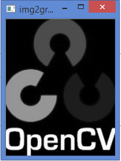

```python
ret, mask = cv2.threshold(img2gray, 10, 255, cv2.THRESH_BINARY)
```

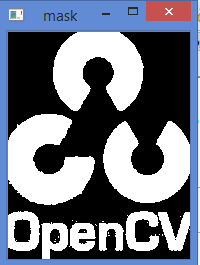

```python
mask_inv = cv2.bitwise_not(mask)
```

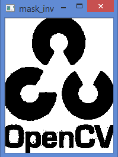

```python
img1_bg = cv2.bitwise_and(roi,roi,mask = mask_inv)
```

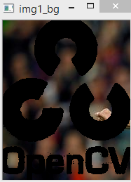

```python
img2_fg = cv2.bitwise_and(img2,img2,mask = mask)
```

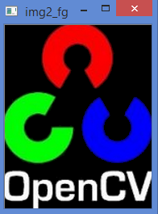

```python
dst = cv2.add(img1_bg,img2_fg)
```


```python
img1[0:rows, 0:cols ] = dst
```


# Conclusion

Here we have run through some exercises on image addition and blending. We also performed Bitwise operation to essentially enable opague overlaying of an image over another.