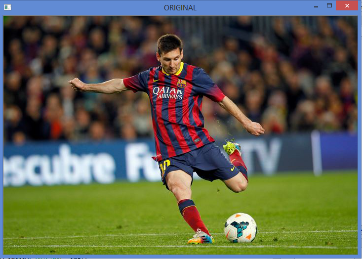
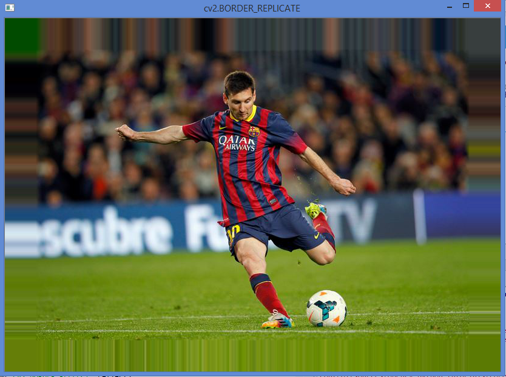
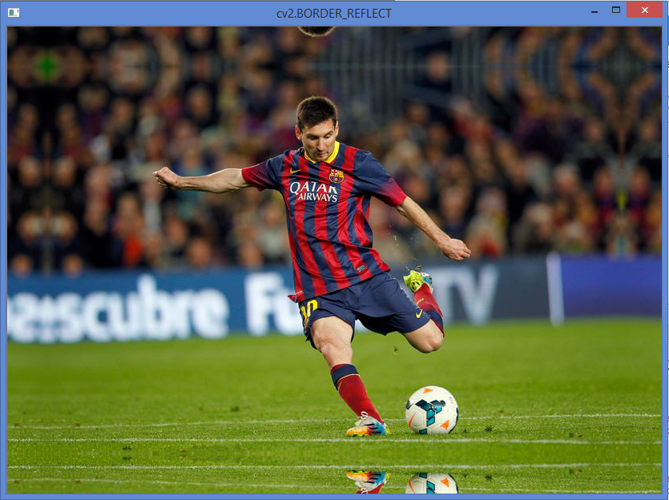
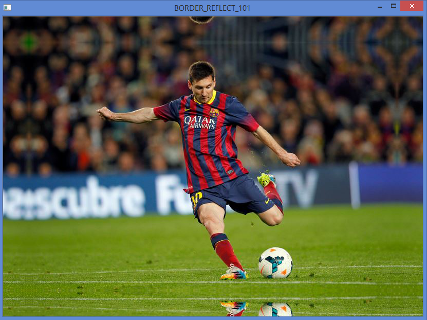
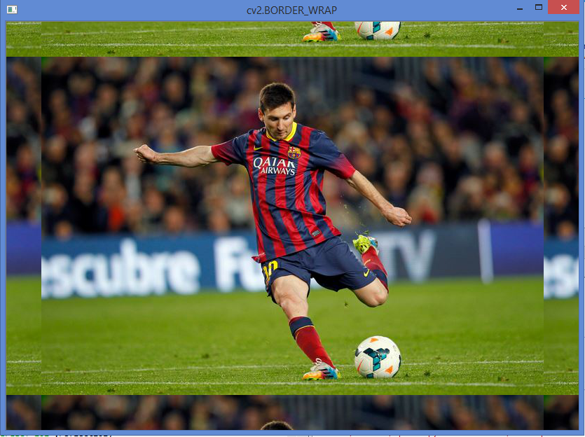
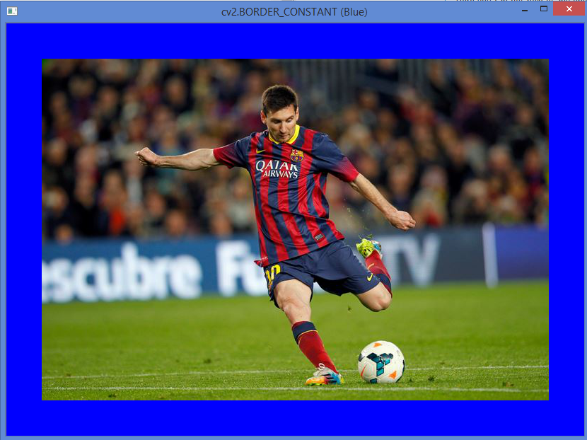

# Basic Operations on Images

See [OpenCV-Python Tutorials - Basic Operations on Images](https://opencv-python-tutroals.readthedocs.org/en/latest/py_tutorials/py_core/py_basic_ops/py_basic_ops.html#basic-ops) for the original tutorial.

# Demo Modify Image

Run the demo code `demo_modify_image.py`.

This covers:

- Accessing and Modifying pixel values
- Accessing Image Properties
- Image ROI (Region of Interest)
- Splitting and Merging Image Channels

Some screenshots:

Origina image:

Add a white pixel at row 100, column 150:

Add a red pixel at row 100, column 150:

Show the ball only:

Copy and paste the ball to somewhere else:

Image after split and merge:

Reduce the BGR red scale to 0:

# Demo Making Borders for Images (Padding)

Run the demo code `demo_add_border_to_image.py`.

Some snapshots:

Original image - no border:

Border Option - `cv2.BORDER_REPLICATE`:

Border Option - `cv2.BORDER_REFLECT`:

Border Option - `cv2.BORDER_REFLECT_101`:

Border Option - `cv2.BORDER_WRAP`:

Border Option - `cv2.BORDER_CONSTANT` (Blue):

# Conclusion

Some cool examples demonstrating basic operations around accessing and manipulating an image (matrix).
