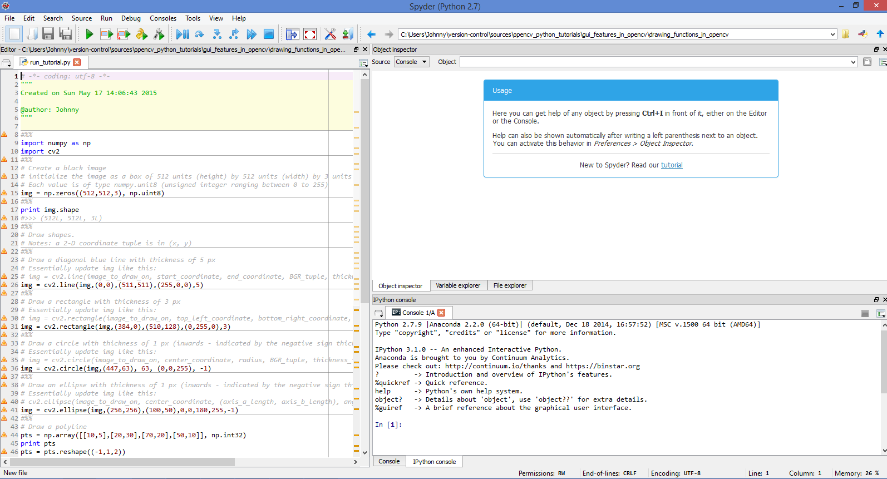
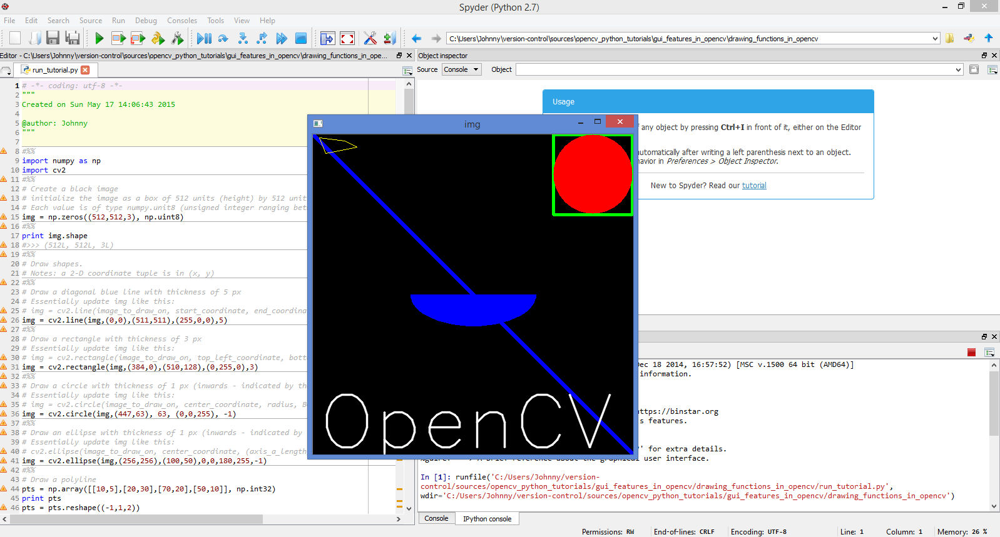

# Drawing Functions in OpenCV

Use this space top play around with drawing functions in OpenCV.

Resources:

- [Main Tutorial Page - Drawing Functions in OpenCV](https://opencv-python-tutroals.readthedocs.org/en/latest/py_tutorials/py_gui/py_drawing_functions/py_drawing_functions.html#drawing-functions)
- [OpenCV Doc - Drawing Functions](http://docs.opencv.org/modules/core/doc/drawing_functions.html)

# Test Instructions

The main code is `run_tutorial.py`. You can run in a number of ways:

## Batch mode

Just do this in a command window:

```
ipython run_tutorial.py
```

## Anaconda Spyder IDE

Make sure to set the current working directory to where the code is stored.

Either run in in chunks or as a whole program:



A new window with the drawing is now displayed:



Use the keyboad key `s` if you want to save the picture (it will save it as `output.jpg`).

Or hit any key to close the window.

# Cautious Notes:

In OpenCV 3.x Version, draw functions mutate `img` and also returns `img`.

```
img = cv2.line(img,...)
img = cv2.rectangle(img,...)
img = cv2.circle(img,...)
img = cv2.ellipse(img,...)
img = cv2.polylines(img,...)
```

In OpenCV 2.x version, draw functions mutate `img` and also `none`.

```
cv2.line(img,...)
cv2.rectangle(img,...)
cv2.circle(img,...)
cv2.ellipse(img,...)
cv2.polylines(img,...)
```

# Conclusion

A nice simple tutorial to illustrate how to use draw functions (to draw things) and reuse of the `cv2.imshow()` to display image.

A drawing essentially is made of a matrix of `height, width, BGR_tuple`.