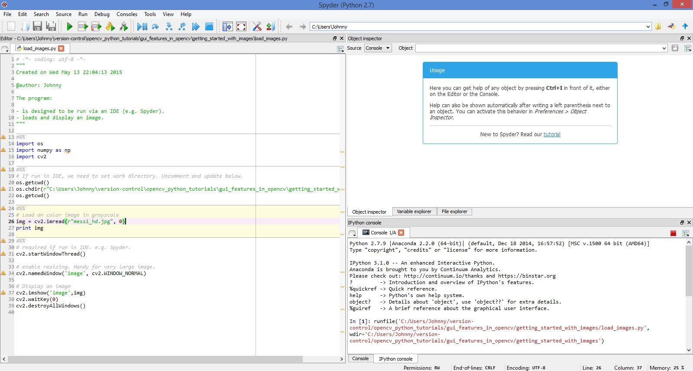
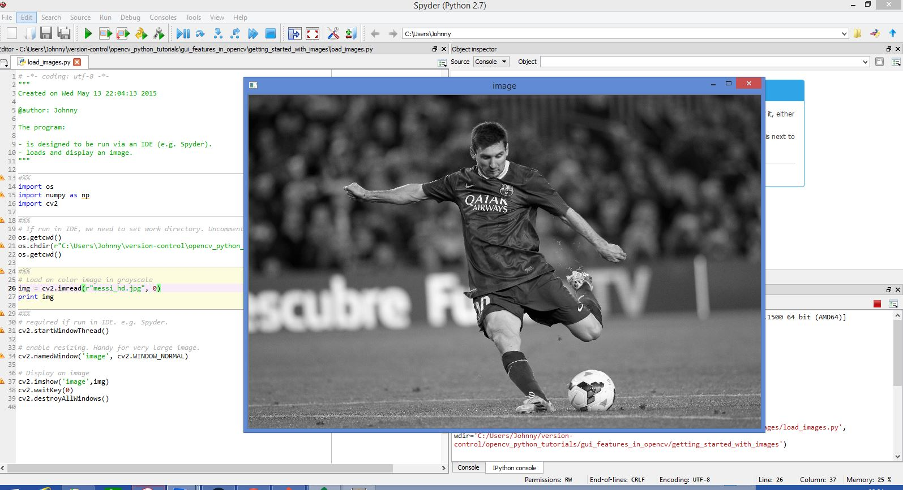

# Getting Started with Images

## How to test program

Open the code in Spyder IDE:

- Start the Spyder IDE.
- Open the file `load_image.py`.
- Update the current working directory (to the location where the `load_image.py` is stored.

Run the code in Spyder IDE:

Close the image preview window:

- Hover the mouse over the image preview window.
- Click on any buttons to close the image preview window. (Officially, hit the `0` key to close.)

Try out other images if we like!

## References

See this [OpenCV-Python Tutorial Page](http://opencv-python-tutroals.readthedocs.org/en/latest/py_tutorials/py_gui/py_image_display/py_image_display.html#display-image) for the official OpenCV-Python Tutorial Instructions.

The image [messi_hd.jpg](messi.jpg) (High Definition version) is obtained from [http://www.biznews.com/wp-content/uploads/2014/04/Barcelona.jpg](http://www.biznews.com/wp-content/uploads/2014/04/Barcelona.jpg). A slightly lower definition version [messi_med.jpg](messi_med.jpg) is also created for playing around with.

