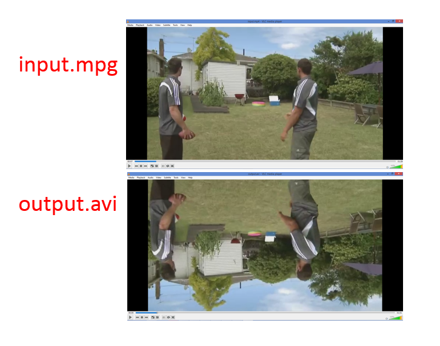

# Getting Started with Videos

## Prerequisites:

- If run via an IDE (like Anaconda). Make sure to change the current working directory to where this directory (i.e. where the Python file and the input video file is stored). The code uses relative pathnames. So this is mandatory for the Video Capture and writer steps.
- Make sure the `ffmpeg` codec is installed and works within OpenCV. This [Stackoverflow forum](http://stackoverflow.com/questions/23119413/how-to-install-python-opencv-through-conda) has provided a good tip on getting this done. Check out the solution by user [eculeus](http://stackoverflow.com/users/2012659/eculeus). This is mandatory for the Video Writer step.

## Test Instructions:

So here are the files that we have to begin with:

- `load_video.py`: the python code that we are going to run.
- `input.mp4` the video that we are going to use to test run our code.

Run the code `load_video.py` and we get a flipped version (`output.avi`)!

# References

The test sample video (`input.mp4`) is originated from [this YouTube Video](https://www.youtube.com/watch?v=3WUUovQwwrM) uploaded by [Brand Spank](https://www.youtube.com/channel/UC-yJ5ogPw3wmWJhyAKEfx2Q). Since at the time of code testing I did not have any video files on my desktop, I used the free and open-source tool [youtube-dl](https://rg3.github.io/youtube-dl/) to download the video from [YouTube](https://www.youtube.com), save it as a MPEG4 (`.mp4`) file. The code uses this `.mp4` file and output a `.avi` format video. The use of this video is purely for illustration purpose.
