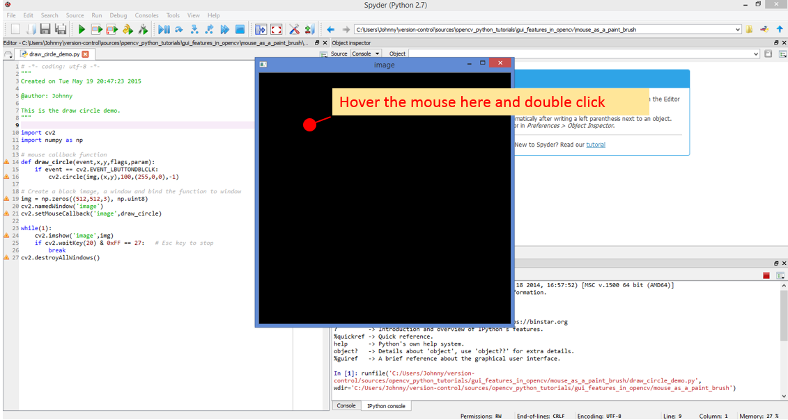
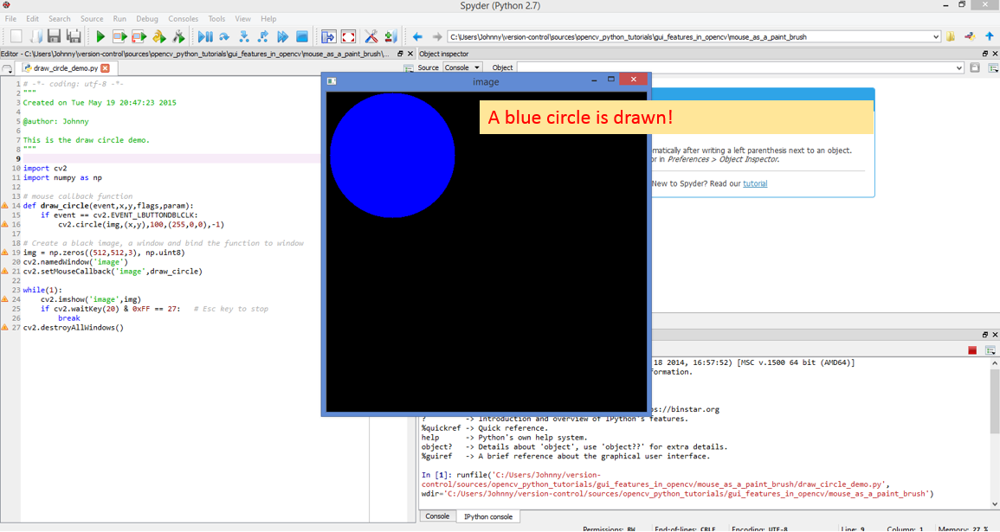
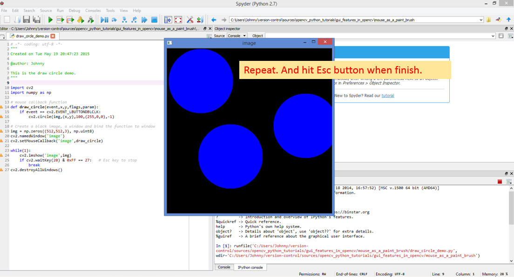

# Mouse as a Paint Brush

This the original official tutorial [at this OpenCV-Python Tutorial Page - Mouse as a Paint Brush](https://opencv-python-tutroals.readthedocs.org/en/latest/py_tutorials/py_gui/py_mouse_handling/py_mouse_handling.html#simple-demo).

# Check what mouse events are available

Run the code `print_available_events` will print out the list of available list of events to choose from. In this case, the output is:

```
['EVENT_FLAG_ALTKEY', 'EVENT_FLAG_CTRLKEY', 'EVENT_FLAG_LBUTTON', 'EVENT_FLAG_MBUTTON', 'EVENT_FLAG_RBUTTON', 'EVENT_FLAG_SHIFTKEY', 'EVENT_LBUTTONDBLCLK', 'EVENT_LBUTTONDOWN', 'EVENT_LBUTTONUP', 'EVENT_MBUTTONDBLCLK', 'EVENT_MBUTTONDOWN', 'EVENT_MBUTTONUP', 'EVENT_MOUSEHWHEEL', 'EVENT_MOUSEMOVE', 'EVENT_MOUSEWHEEL', 'EVENT_RBUTTONDBLCLK', 'EVENT_RBUTTONDOWN', 'EVENT_RBUTTONUP']
```

# Draw Circle Demo

This demo is pretty cool. Run the code `draw_circle_demo.py`.

It opens up a square black canvas (window). Hover over any point on the canvas. If you do a double click on the mouse, it draws out a blue circle.

Double click the mouse at different points will draw circles at those points.

Hit the `Esc` button to exit.






