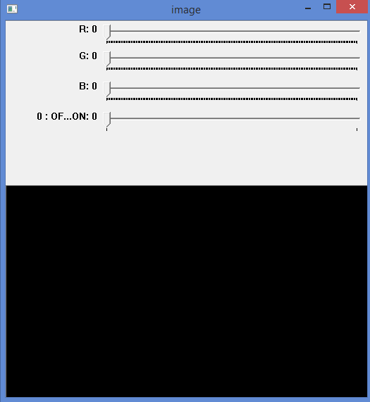
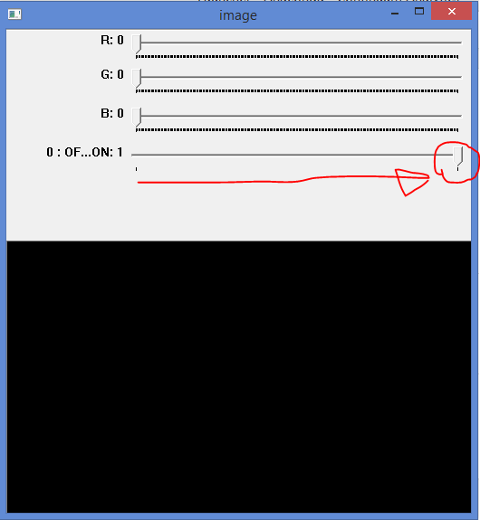
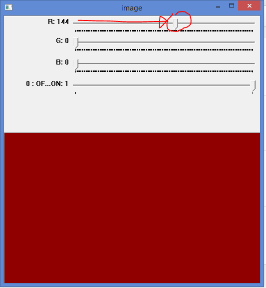
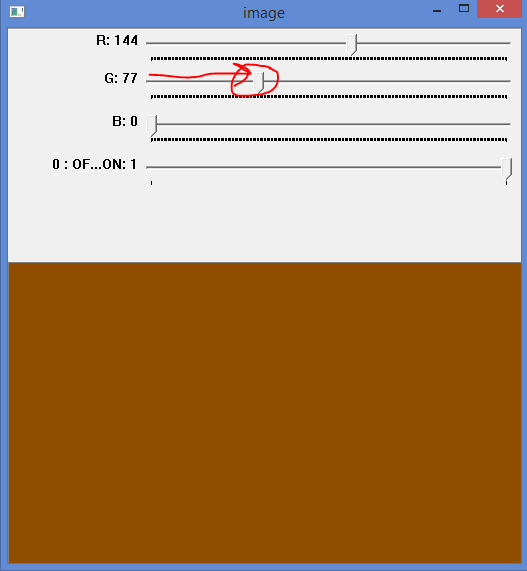
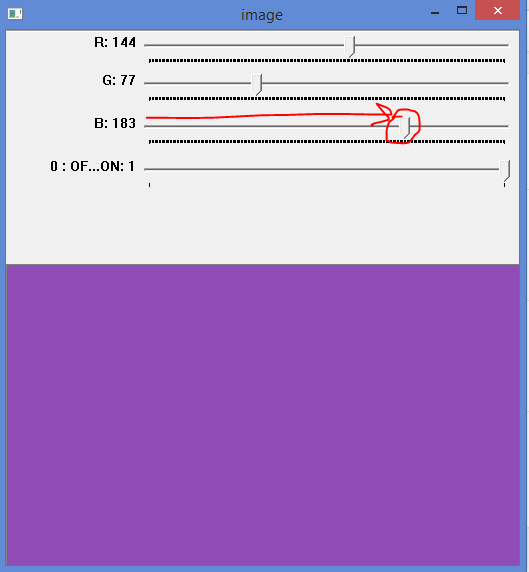
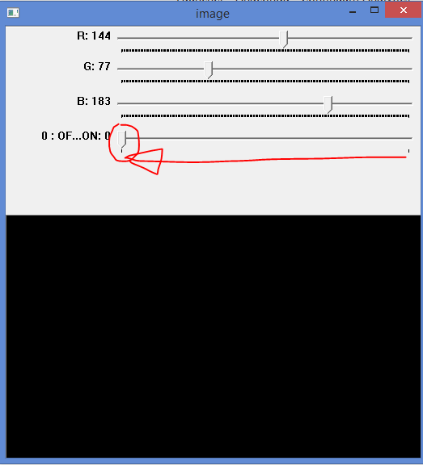

# Trackbar as the Color Palette

See [OpenCV-Python Tutorial - Trakbar as the Color palette](https://opencv-python-tutroals.readthedocs.org/en/latest/py_tutorials/py_gui/py_trackbar/py_trackbar.html#trackbar) for the original tutorial.

## Demo Instructions

Run the program `run_trackbar_tutorial.py`. The output looks like this:

Hit the "Esc" key to close the window.
