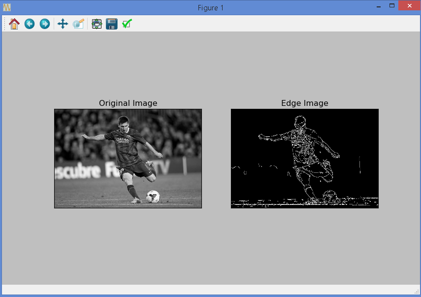
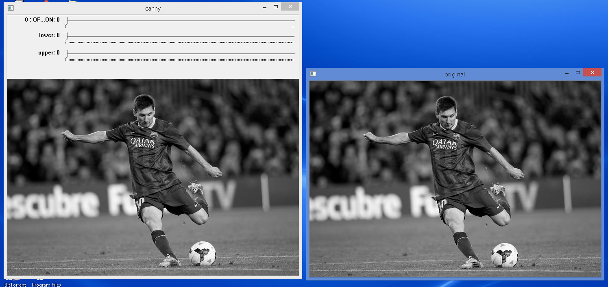
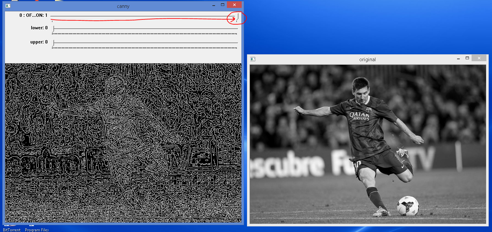
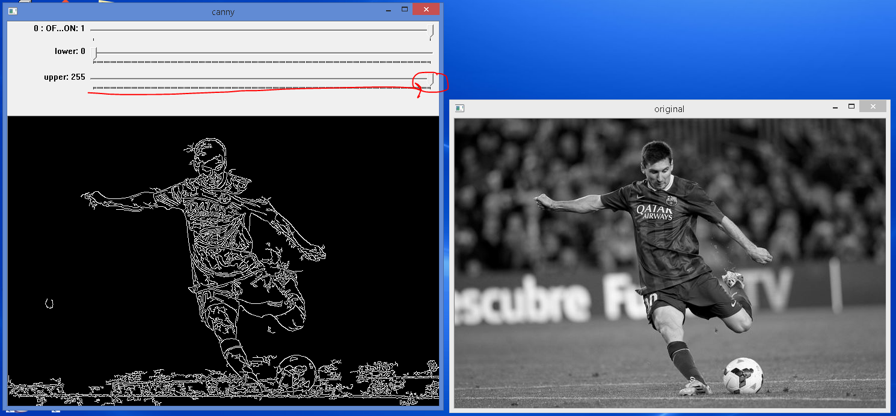
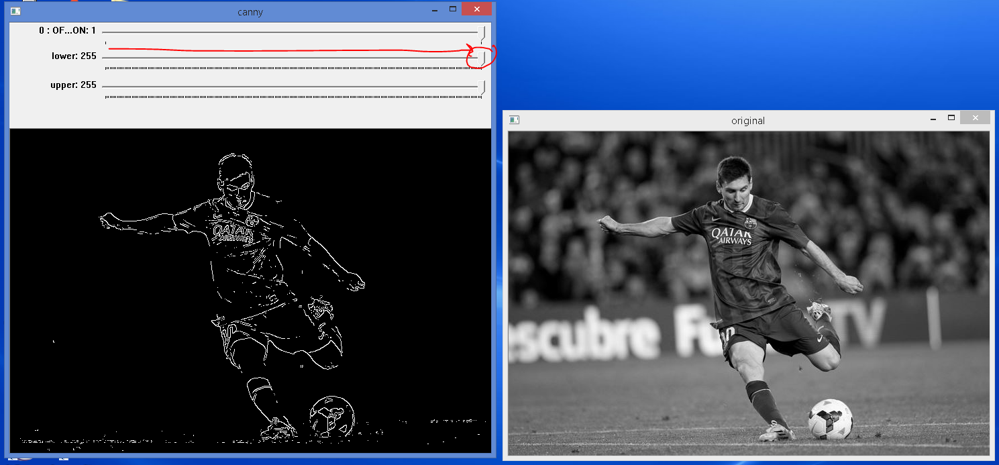
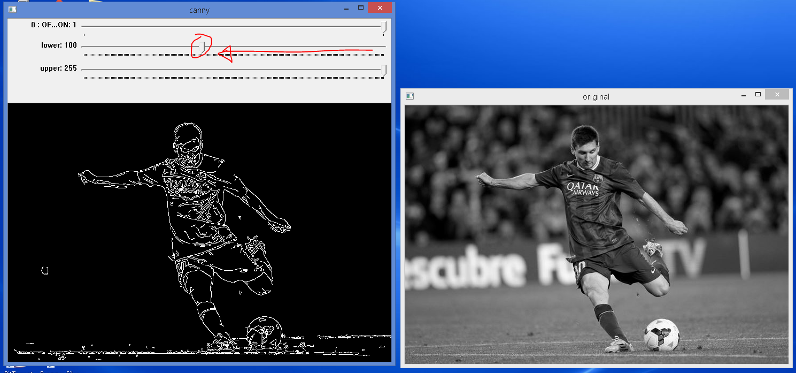
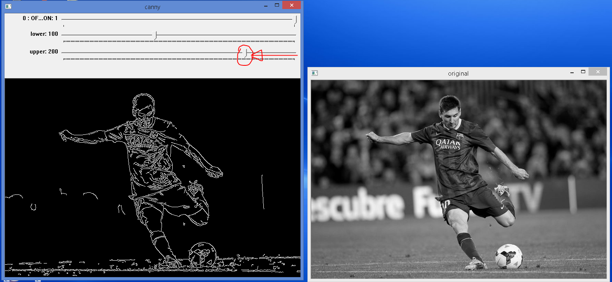
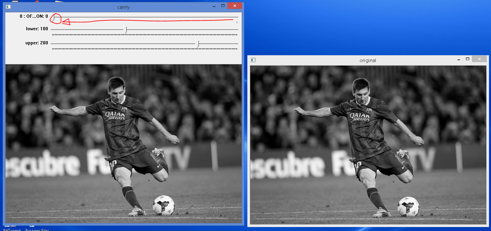

# Canny Edge Detection

See [OpenCV-Python Tutorials - Canny Edge Detection](https://opencv-python-tutroals.readthedocs.org/en/latest/py_tutorials/py_imgproc/py_canny/py_canny.html#canny) for the original tutorials.

# Basic Canny Edge Detection Program

Code: `simple_canny.py`

This is the basic code that illustrate the `cv2.Canny()` Canny Edge Detection method. This illustration code uses a fix lower grayscale threshold of 100 and upper threshold of 200. (Grayscale threshold has a range of between 0 and 255)

Demo output:

# Exercise 1: Enhanced Canny Edge Detection Program with Threshold Trackbars

The challenge: write a small application to find the Canny edge detection whose threshold values can be varied using two trackbars. This way, you can understand the effect of threshold values.

This is a possible solution: `trackbar_canny.py`.

Run the code and it will display the "original" and "canny" images side-by-side.

Demo:

When done playing, hit the "Esc" key to quit.
