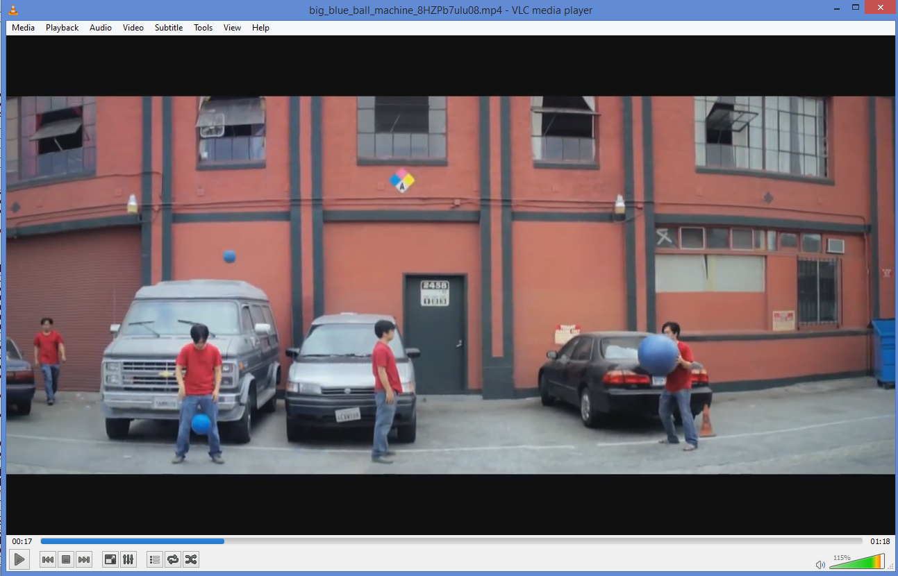
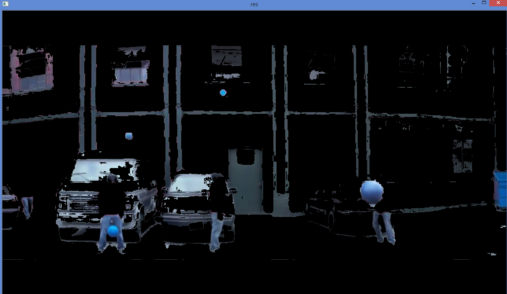

# Image Processing in OpenCV

See [OpenCV-Python - Image Processing in OpenCV](https://opencv-python-tutroals.readthedocs.org/en/latest/py_tutorials/py_imgproc/py_table_of_contents_imgproc/py_table_of_contents_imgproc.html) for the original tutorials.

# Track Blue Ball

The code `track_blue_ball.py` illustrate this.

The key is to find the lower and upper HSV range of the color to track. (`lower_blue` and `upper_blue`). I estimated these values using GIMP (in which the Hue value ranges between 0 and 360. So whatever I get in GIMP I just need to halve it in order to get the equivalent OpenCV Hue value.)

Note: I downloaded the video `big_blue_ball_machine_8HZPb7ulu08.mp4` from Youtube.

Some screenshots:

Frame:

Mask:

Result:

# Demo convert GBR to HSV

The code `demo_gbr_to_hsv` illustrates quick conversion from one color space (GBR) to another (HSV).
