# Contours Features

See [OpenCV-Python - Contour Features](https://opencv-python-tutroals.readthedocs.org/en/latest/py_tutorials/py_imgproc/py_contours/py_contour_features/py_contour_features.html#contour-features) for the original tutorials.

# Moments

The code `demo_moments.py` illustrate computation of the internal area bounded by a contour.

Sample Image:


Computed moments:

```
{'mu02': 61222871.79252696, 'mu03': -40137.822982788086, 'm11': 650567591.9166666, 'nu02': 0.07628711803059755, 'm12': 106985566150.75, 'mu21': 50080.6704750061, 'mu20': 66620763.09886503, 'nu20': 0.08301319211282009, 'm30': 132152169588.75, 'nu21': 3.707592743768182e-07, 'mu11': 1205.5144815444946, 'mu12': -143020.32474708557, 'nu11': 1.5021383814341916e-06, 'nu12': -1.058813936024084e-06, 'm02': 699019932.8333333, 'm03': 123257942828.5, 'm00': 28329.0, 'm01': 4250665.0, 'mu30': 159372.7953338623, 'nu30': 1.1798752171833967e-06, 'nu03': -2.9714997788599144e-07, 'm10': 4335767.5, 'm20': 730212129.3333333, 'm21': 109566134107.41667}
```

# Contour Area

The code `demo_area.py` illustrate computation of the internal area bounded by a contour.

Sample Image:


Computed area (in pixels): `28329.0`

# Contour Perimeter

The code `demo_perimeter.py` illustrate computation of a contour perimeter.

Sample Image:


Computed perimeter (in pixels): `631.126977205`

# Contour Approximation

The code `demo_contour_approx.py` illustrate computation of approximated contour points at varying epsilon factor (i.e. proportion of perimeter). This is essentially the maximum distance of approximated contour from the actual object boundary line allowable - the smaller the epsilon factor, the more accurate the contour points (but more costly - as more points are required).

Sample Image:


Output at Epsilon Factor `0.5`:

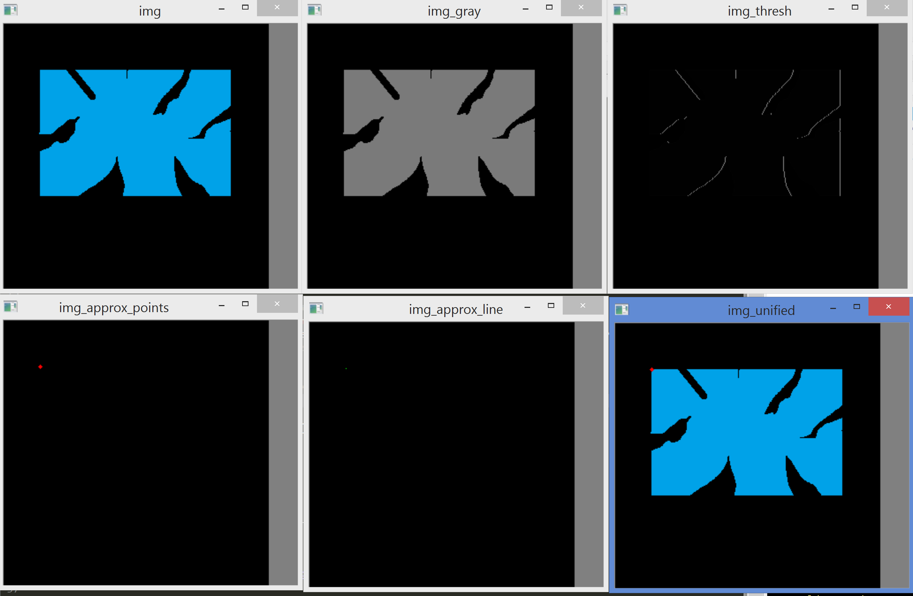

Output at Epsilon Factor `0.1`:

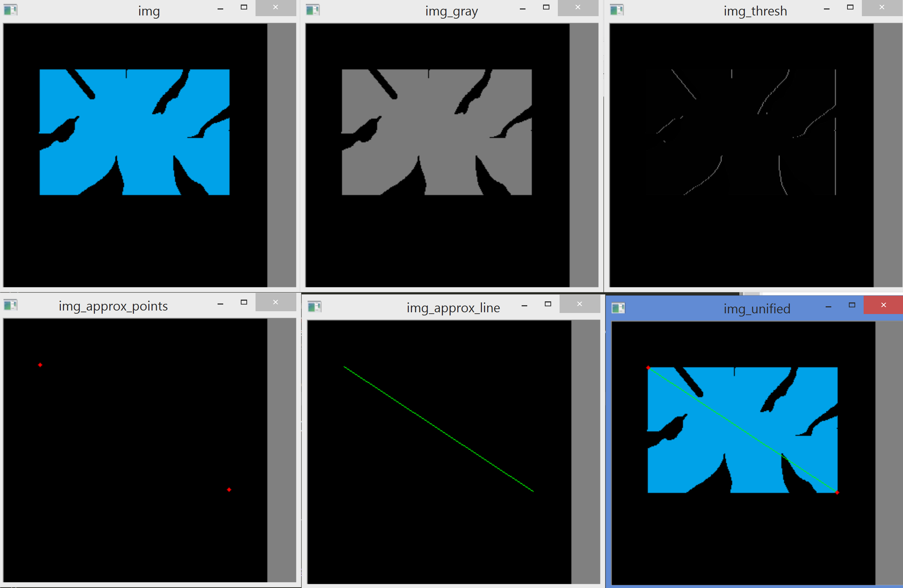

Output at Epsilon Factor `0.05`:

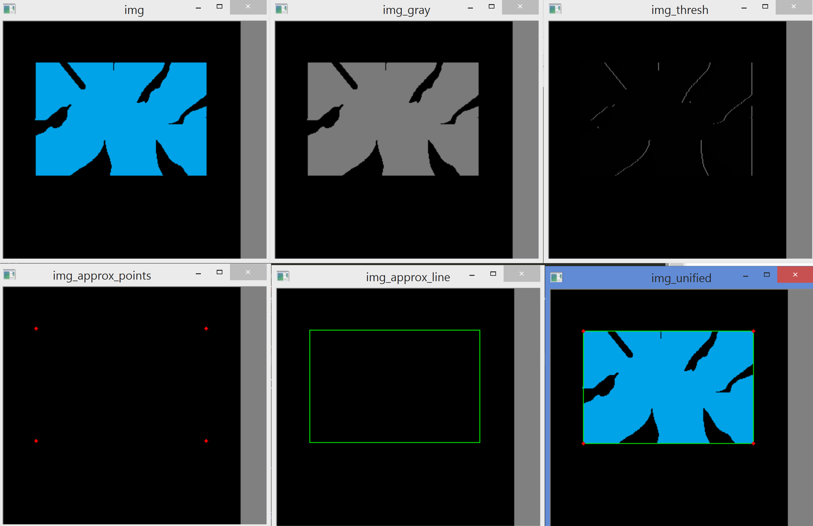

Output at Epsilon Factor `0.01`:


Output at Epsilon Factor `0.001`:


# Convex Hull and Checking Convexity

The code `demo_contour_convexity.py` illustrate the creation of Convex Hull contour, and checking the hull convexity (`True` or `False`).

Output:

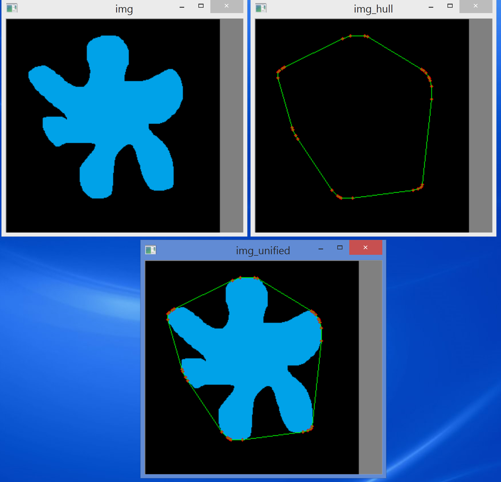

The `cv2.isContourConvex(hull)` step in the code returns `True` - indicating that the image is a convex shape.

# Bounding Rectangle

The code `demo_bounding_rectangle.py` illustrate both straight and rotated bounding rectangles.

Output:

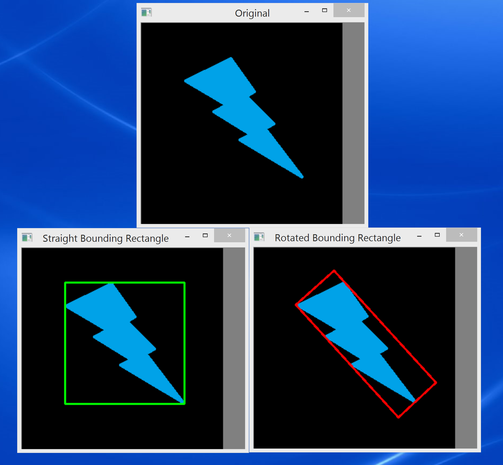

# Minimum Enclosing Circle

The code `demo_min_enclosing_circle.py` illustrate minimum enclosing circle.

Output:

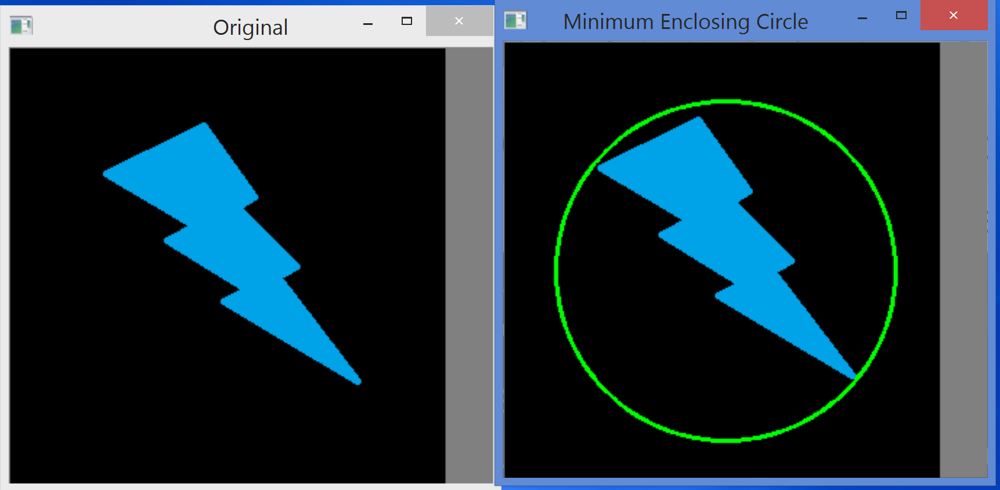

# Fit an eclipse

The code `demo_fit_eclipse.py` illustrate fitting a rotated eclipse to a shape. It is essentially a rotated rectangle, but with a eclipse instead.

Output:

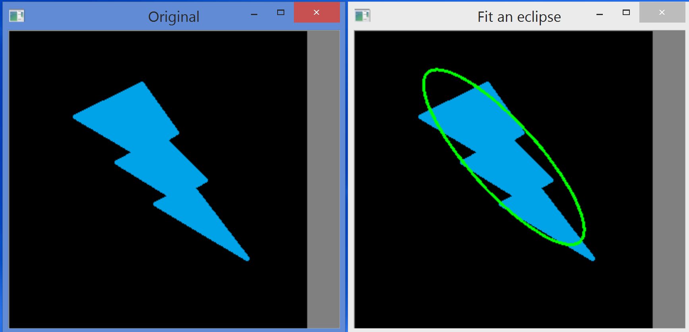

# Fit a line

The code `demo_fit_line.py` illustrate fitting a line to a shape.

Output:

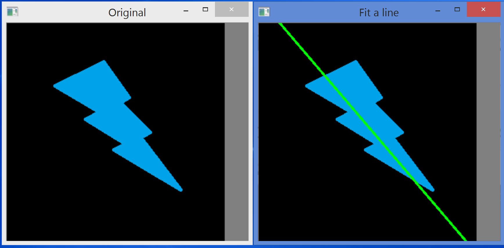

# Bonus: Trackbar Contour Approximation App

The code: `trackbar_contour_approx.py`.

This is my attempt to enhance the Contour Approximation Program (See the Contour Approximation Section above) by adding a trackbar corresponding to the epsilon factor.

Due to the fact that trackbar takes on integer values only, if we are to vary at decimal levels (e.g. 0.001, 0.01, 0.1, etc.), I've figured that if I have a step internally within the code that divide integer trackbar by some sort of scaling factor, say 1000. For example, Say on the trackbar I have an integer value of 5, to convert that to 0.005, I would require a scaling factor of 1000. i.e. `5 / 1000 = 0.005`.

Some snaoshots:

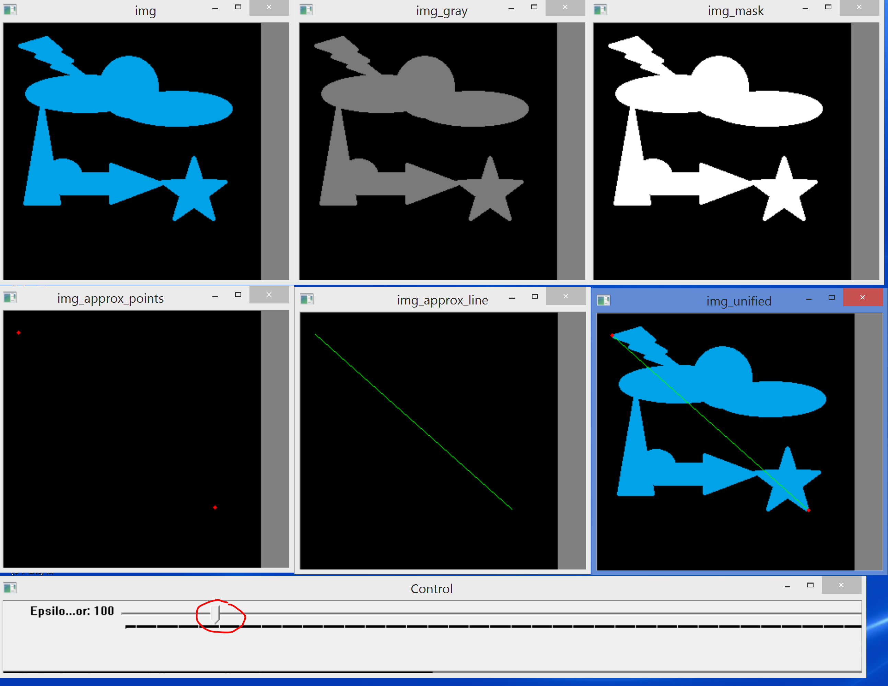


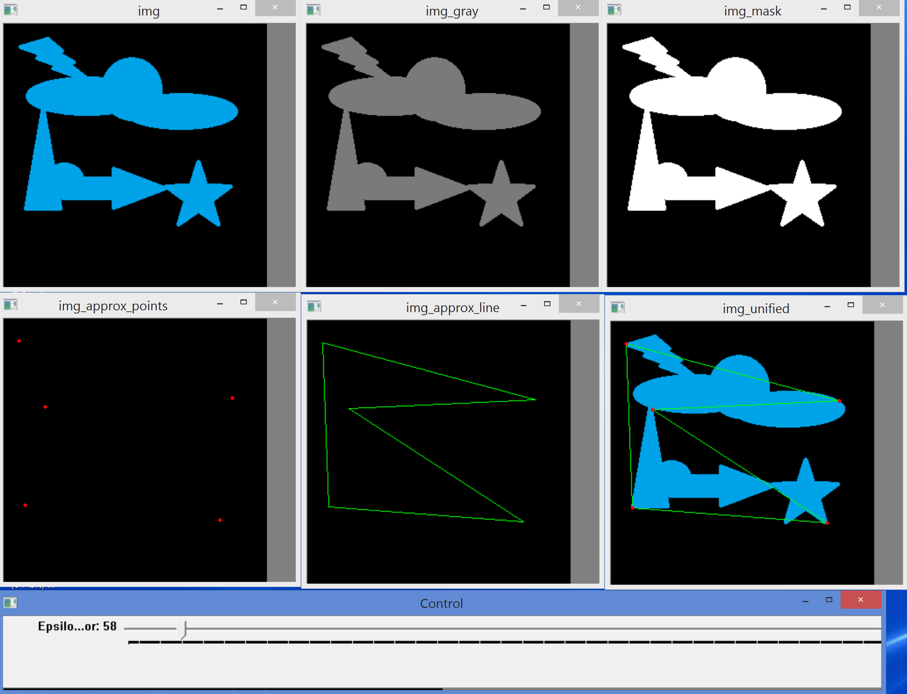

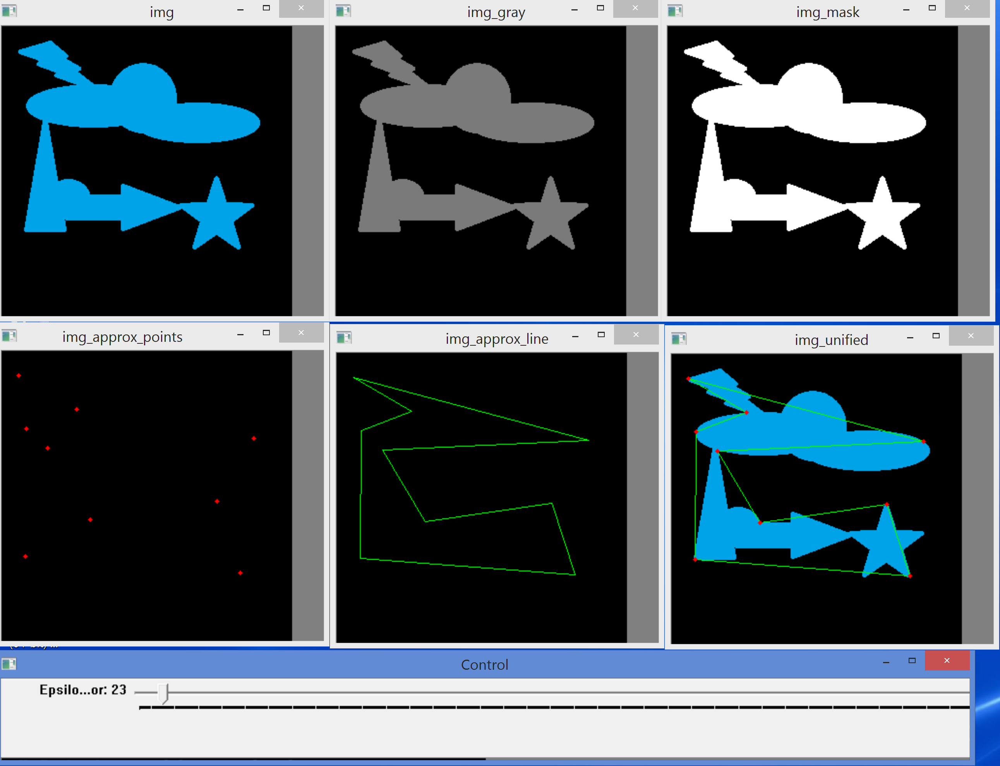

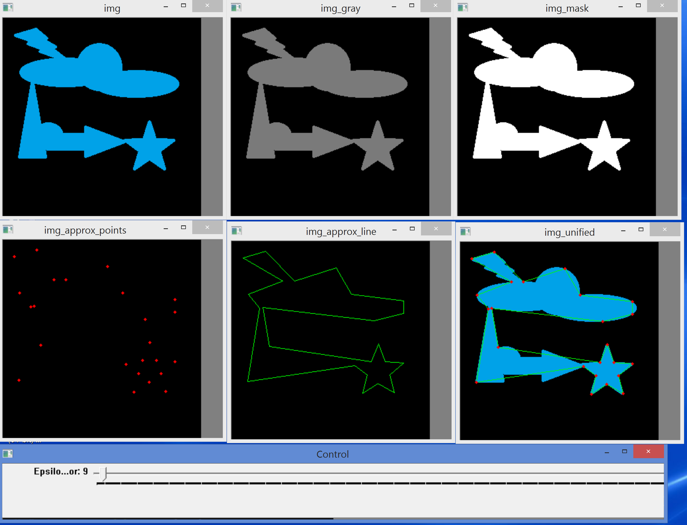

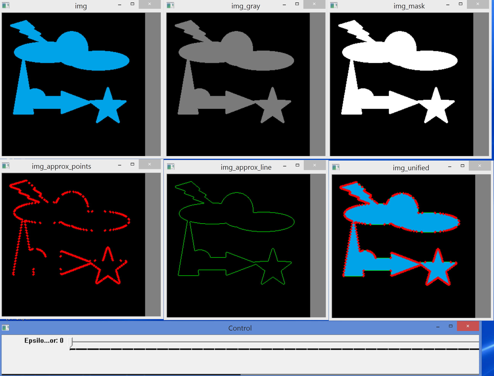
