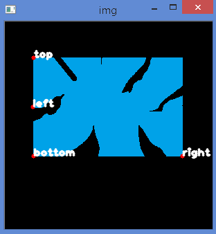
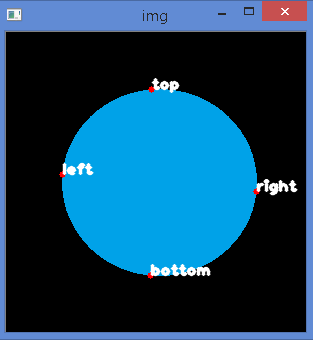
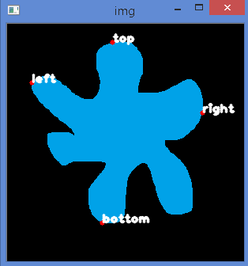
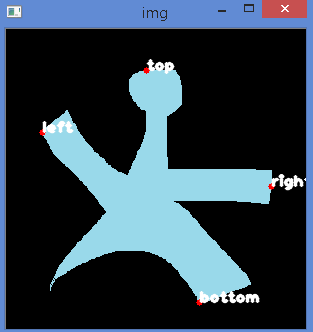
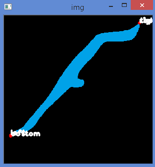
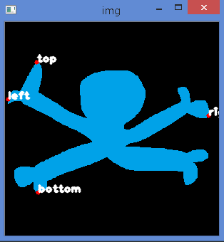
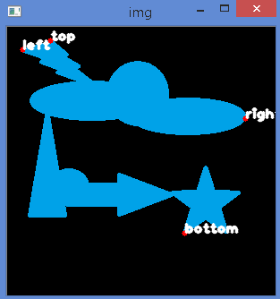

# Contour Properties

See [OpenCV-Python Tutorials - Contour Properties](https://opencv-python-tutroals.readthedocs.org/en/latest/py_tutorials/py_imgproc/py_contours/py_contour_properties/py_contour_properties.html#contour-properties) for the original tutorials.

# The Contour class

Demonstration codes: `Contour.py`.

As I've noticed there are lots of properties to explore in this chapter, for ease of experimenting, I have created `Contour.py` which essentially contain the `Contour` class. It contains all the methods needed to enable us to easily create a Contour object and obtain the following properties:

- Aspect Ratio
- Extent
- Solidity
- Equivalent Diameter
- Orientation
- Mask and Pixel Points
- Max-Min values and Locations
- Mean Color / Intensity
- Extreme Points

To use the class, simply do this (make sure the current directory is set to where the codes are stored):

```
In [1]: from Contour import Contour

In [2]: a = Contour("blue1.png")

In [3]: print a.extreme_points
{'top': (145, 57), 'right': (250, 159), 'bottom': (144, 243), 'left': (56, 142)}

In [4]: dir(a)
Out[4]: 
['__class__',
 '__delattr__',
 '__dict__',
 '__doc__',
 '__format__',
 '__getattribute__',
 '__hash__',
 '__init__',
 '__module__',
 '__new__',
 '__reduce__',
 '__reduce_ex__',
 '__repr__',
 '__setattr__',
 '__sizeof__',
 '__str__',
 '__subclasshook__',
 '__weakref__',
 'area',
 'aspect_ratio',
 'coordinates',
 'equivalent_diameter',
 'extent',
 'extreme_points',
 'file_name',
 'get_area',
 'get_aspect_ratio',
 'get_coordinates',
 'get_equivalent_diameter',
 'get_extent',
 'get_extream_points',
 'get_img',
 'get_img_gray',
 'get_img_thresh',
 'get_mask',
 'get_mean_val',
 'get_min_max_loc',
 'get_orientation',
 'get_pixel_points',
 'get_solidity',
 'img',
 'img_gray',
 'img_thresh',
 'mask',
 'mean_val',
 'min_max_loc',
 'orientation',
 'pixel_points',
 'show_image',
 'solidity']
```

# Plot Extreme Points

Demonstration codes: `plot_extreme_points.py` (that uses the `Contour` class from `Contour.py`).

To illustrate plotting the extreme points (leftmost, rightmost, topmost, bottommost) to a given image, I've created `plot_extreme_points.py` that essentially import the `Contour` class (from `Contour.py`), followed by doing the plotting. (Change the file names for experimenting purposes).

Some screenshots:















