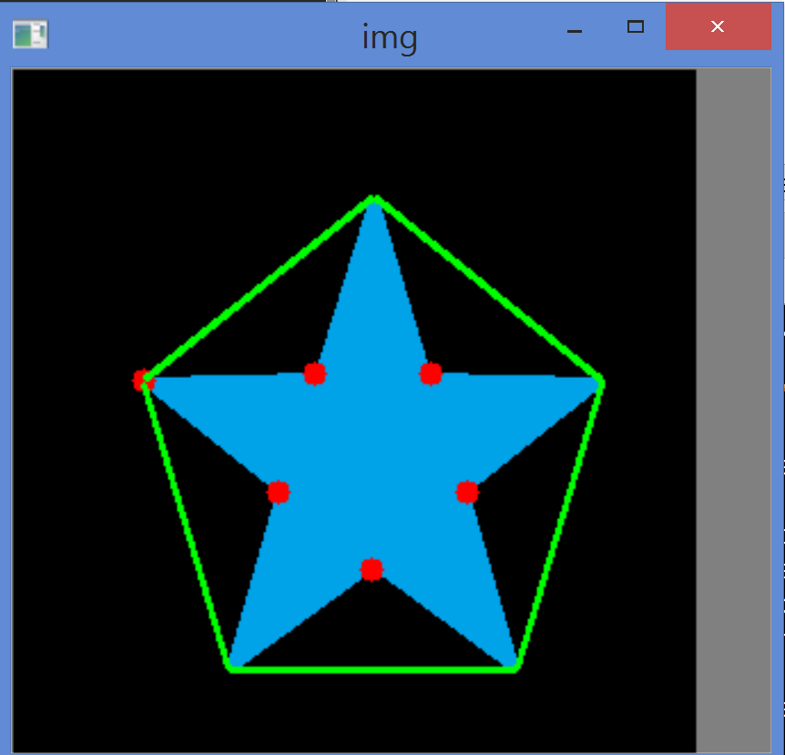

# Contours - More Functions

See [OpenCV-Python - Contours: More Functions](https://opencv-python-tutroals.readthedocs.org/en/latest/py_tutorials/py_imgproc/py_contours/py_contours_more_functions/py_contours_more_functions.html#contours-more-functions) for the original tutorial.

# Convexity Defects

Tutorial demo code: `demo_convexity_defect.py`.

Screenshot Output:

.

I've also created an alternative `visualize_convexity_defect.py` which may be used to loop through a number of sample images and process in a serial mode.

# Point Polygon Test

Check whether a point is outside / on-the / inside the contour...

When a point is outside the contour:

```
In [4]: cv2.pointPolygonTest(cnt,(150,150),True)
Out[4]: 24.748737341529164
```

When a point is on the contour:

```
In [16]: cv2.pointPolygonTest(cnt,(183,133),True)
Out[16]: 0.0
```

When a point is inside the contour:

```
In [5]: cv2.pointPolygonTest(cnt,(50,50),True)
Out[5]: -85.37564055396598
```
