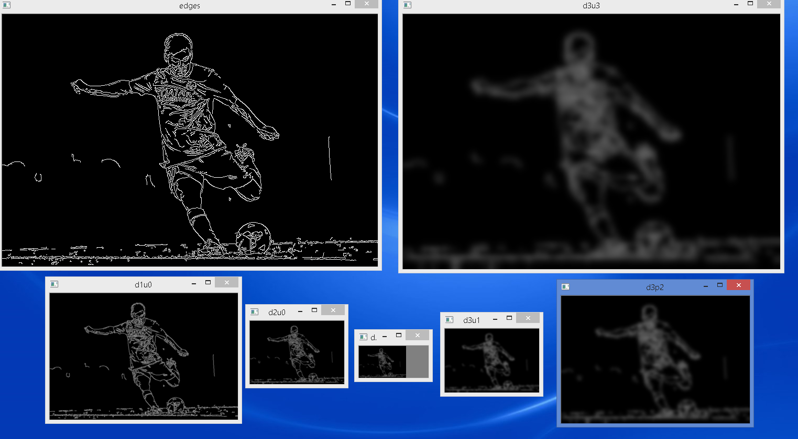
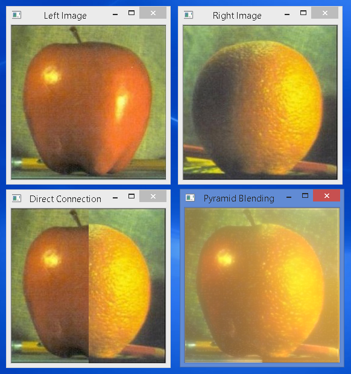
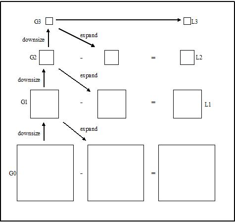
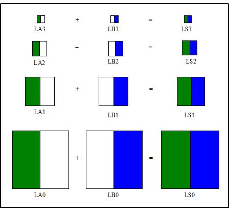
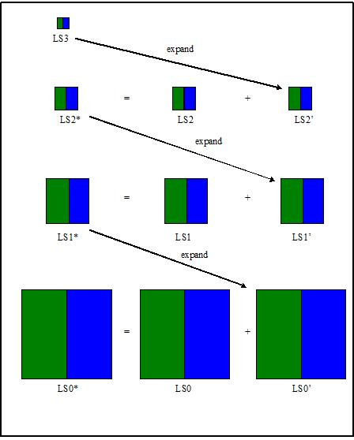

# Image Pyramids

See [OpenCV-Python Tutorials - Image Pyramids](https://opencv-python-tutroals.readthedocs.org/en/latest/py_tutorials/py_imgproc/py_pyramids/py_pyramids.html#pyramids) for the original tutorials.

Image Pyramid as a picture:


# cv2.pyrDown and cv2.pyrUp

See the [official OpenCV documentation on cv2.pyrDown and cv2.pyrUp](http://docs.opencv.org/modules/imgproc/doc/filtering.html) for more info.

- `cv2.pyrDown`: Blurs an image and downsamples (half the size) it.
- `cv2.pyrUp`: Upsamples (double the size) an image and then blurs it.

## Demo with Grayscale Image

This demo code `pyramid.py` illustrate the use of `cv2.pyrDown` and `cv2.pyrUp`.

Illustration:

1. Starting with an original image
2. pyrDown 1st time to blur and downsample it.
3. pyrDown 2nd time to blur and downsample it.
4. pyrDown 3rd time to blur and downsample it.
5. pyrUp 1st time to upsample an image and then blur it.
6. pyrUp 2st time to upsample an image and then blur it.
7. pyrUp 3st time to upsample an image and then blur it.
8. The resulting image become the same size as the original, but blurred (due to all the lost of pixels during the blurring processes).

Output:


## Demo with Edged Image

This demo code `pyramid_edged_image.py` essentially is the same as the above `pyramid.py`. I merely replace the original grayscale image with an edged image, created using the Cunny Edge Detector, as mentioned in [the OpenCV-Python Tutorials - Cunny Edge Detection](https://opencv-python-tutroals.readthedocs.org/en/latest/py_tutorials/py_imgproc/py_canny/py_canny.html#canny) chapter.

i.e. this one line is inserted to the code:

```.python
edges = cv2.Canny(img, 100, 200)
```

(and we replace the original image with this one)

This is the output:




# Pyramid Blending

## The code

The code `pyramid_image_blending.py` illustrate blending two images (left and right) together, using a combination of Gussian and Laplacian Pyramids.

## The Output

The output produced by the code:



## How does the blending process work?

I've compiled the explaination of the blending process by compiling the materials taken from [this page by University of Wisconsin-Madison](http://pages.cs.wisc.edu/~csverma/CS766_09/ImageMosaic/imagemosaic.html) and the [OpenCV-Python Tutorials - Image Pyramids). All credits go to these guys.

---

Laplacian pyramid is an algorithm using Gaussian to blend the image while keeping the significant feature in the mean time. It downsizes the image into different levels (sizes) with Gaussian. Later it expands the Gaussian in to the lower lever and subtracts from the image in that lever to acquire the Laplacian image.



After generating Laplacian pyramids for the overlap images A and B, we combine the two images in different Laplacian levels by combining partial images from each of them.





Afterward, we expand the LS from the top level (N) to the next level (N-1) and add it to the original Laplacian image in the corresponding layer to generate the latest Laplacian image in the corresponding layer. We repeat this step until reaching ground level and the final result will be the blending image

---

It has taken me a while to understand this. My suggestion is to have the code and the above diagrams in front of you side-by-side. Follow it through and eventually things shall become clear.
