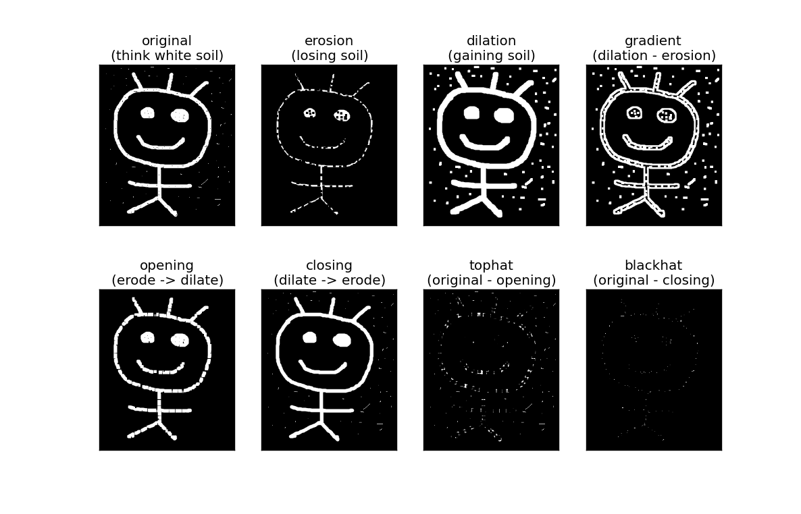

# Morphological Transformations

See [OpenCV-Python Tutorials - Morphological Transformations](https://opencv-python-tutroals.readthedocs.org/en/latest/py_tutorials/py_imgproc/py_morphological_ops/py_morphological_ops.html#morphological-ops) for the original tutorial.

# The Smily Face Example

Demo code: `compare_morph.py`

Say we have this grayscale smily face image:


Notice these noises:

- white dots in the (black) background.
- black dots in the (white) foreground.

We can use Morphological Transformations to detect and/or remove these noises.

For this illustration, we use a 5-by-5 kernal.

```
import cv2
import numpy as np

kernel = np.ones((5, 5), np.uint8)
img = cv2.imread('smily_original_noisy.png', 0)
erosion = cv2.erode(img, kernel, iterations=1)
dilation = cv2.dilate(img, kernel, iterations=1)
gradient = cv2.morphologyEx(img, cv2.MORPH_GRADIENT, kernel)
opening = cv2.morphologyEx(img, cv2.MORPH_OPEN, kernel)
closing = cv2.morphologyEx(img, cv2.MORPH_CLOSE, kernel)
tophat = cv2.morphologyEx(img, cv2.MORPH_TOPHAT, kernel)
blackhat = cv2.morphologyEx(img, cv2.MORPH_BLACKHAT, kernel)
```

Here is the output (see `compare_morph.py` for the complete code):



This is just a basic illustration. To truely understand noise and learn how to remove / extract them, we believe more sophisticated methods may be required.

# Conclusion

Here we have presented a simple comparison of the various morphological transformations and understand their feature and potential usage / purpose.