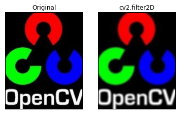
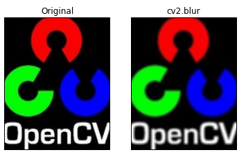
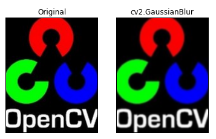
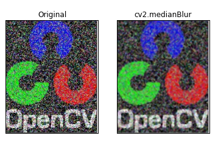
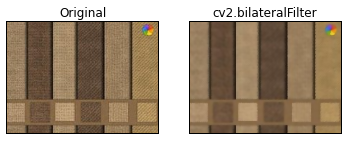

# Smoothing Images

See [OpenCV-Python Tutorials - Smoothing Images](https://opencv-python-tutroals.readthedocs.org/en/latest/py_tutorials/py_imgproc/py_filtering/py_filtering.html) for original tutorials.

# cv2.filter2D

code: `smooth_image_with_filter2d.py`.

Screenshots:

# cv2.blur

code: `smooth_image_with_blur.py`.

Screenshots:

# cv2.GaussianBlur

code: `smooth_image_with_gaussian_blur.py`.

Screenshots:

# cv2.medianBlur

code: `smooth_image_with_median_blur.py`.

Screenshots:

# cv2.bilateralFilter

code: `smooth_image_with_bilateral_filter.py

Screenshots:

# Conclusion

Here we have illustrated a number of image smoothing options.